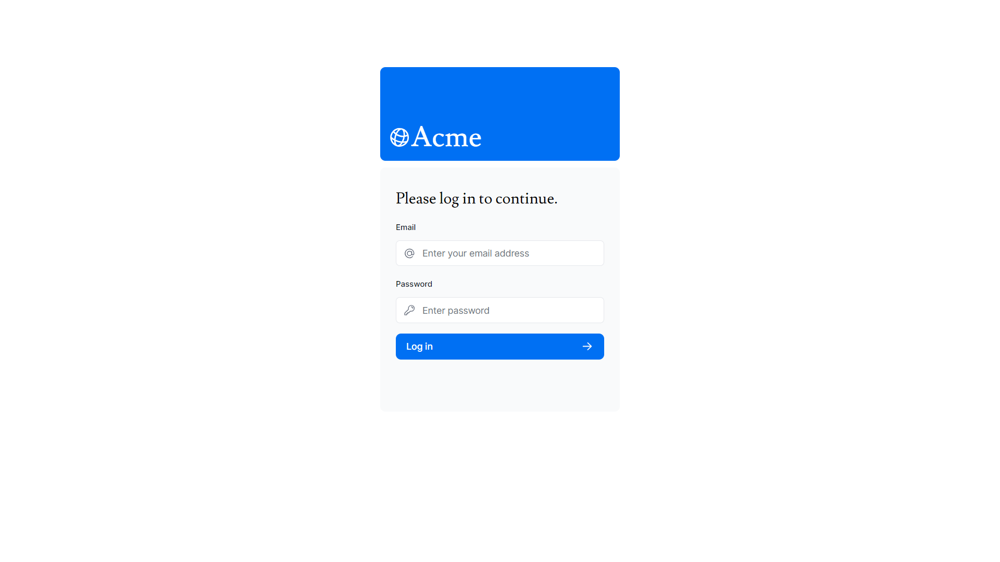
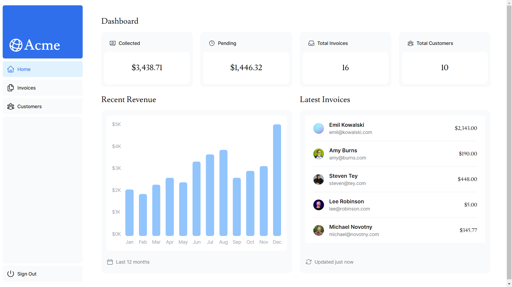
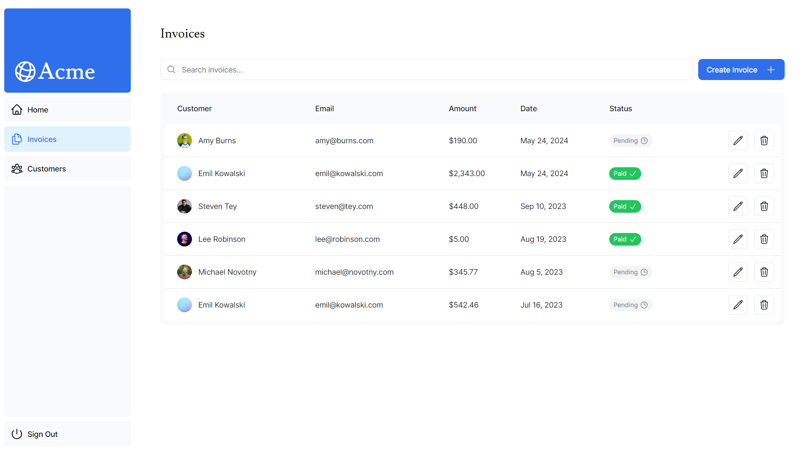
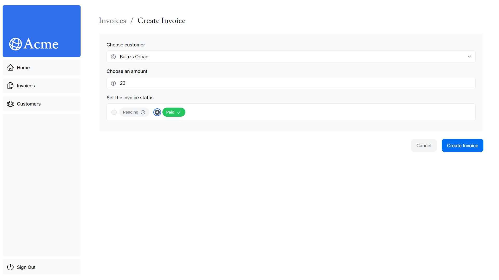
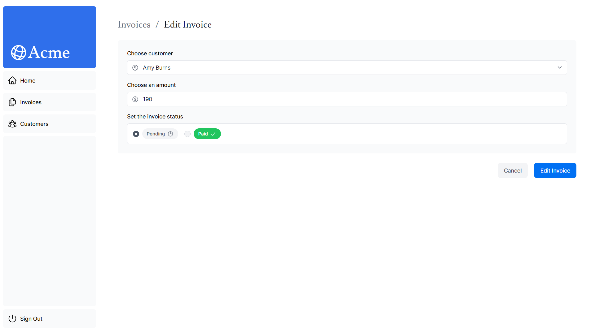

# Next JS Invoice Dashboard

## Description

This is a simple Invoice Dashboard web application built with Next.js. It allows users to manage their invoices by viewing, creating, editing, and deleting invoices. Additionally, it offers a dashboard view for users to gain insights into their invoice information.

## Check out the [App Demo](https://nextjs-dashboard-six-murex-39.vercel.app)

## App User Interface

- **Login Screen:**
  
- **Home Screen:**
  
- **Invoice Screen:**
  
- **Create Invoice Screen:**
  
- **Edit Invoice Screen:**
  

## Getting Started

To get a local copy up and running, follow these simple steps:

### Prerequisites

Ensure you have the following installed on your machine:

- [Node.js](https://nodejs.org/) (18.17.0)
- Operating systems: macOS, Windows (including WSL), or Linux.

### Installation

1. **Clone the repository:**

   ```bash
   git clone https://github.com/Rithrita-Kong/nextjs-dashboard.git
   ```

2. **Navigate into the Project Directory:**

   ```bash
   cd nextjs-dashboard
   ```

3. **Install Dependencies**
   ```bash
   npm install
   ```
4. **Cofig your .env file:**
   Create a .env file in the root directory and add the necessary environment variables. Here's an example:

   ```bash
   POSTGRES_URL=
   POSTGRES_PRISMA_URL=
   POSTGRES_URL_NON_POOLING=
   POSTGRES_USER=
   POSTGRES_HOST=
   POSTGRES_PASSWORD=
   POSTGRES_DATABASE=

   # `openssl rand -base64 32`
   AUTH_SECRET=
   AUTH_URL=http://localhost:3000/api/auth
   ```

5. **Start the development server:**

   ```bash
   npm run dev
   ```

6. Open your browser and go to [http://localhost:3000](http://localhost:3000) to view the app.

7. **Login Credentials:**
   Use the following credentials to log in to the application:

- Email: user@nextmail.com
- Password: 123456

## Features in the Web App

- User Authentication: Login and Logout functionality.
- Invoice Management: Create, Read, Update, Delete invoices.
- Dashboard View: Gain insights into invoice information.
- Responsive Design: Optimized for both mobile and desktop views.
- Invoice Search: Easily find specific invoices.
- Pagination: Efficiently browse through invoices.

## Credits

This project was created by following the official Next JS tutorial from Chapter 1 to Chapter 16. Follow the [Next JS tutorial](https://nextjs.org/learn). Furthermore, this is an overview of features I've learnt after finishing this course:

1. Styling: The different ways to style your application in Next.js.
2. Optimizations: How to optimize images, links, and fonts.
3. Routing: How to create nested layouts and pages using file-system routing.
4. Data Fetching: How to set up a database on Vercel, and best practices for fetching and streaming.
5. Search and Pagination: How to implement search and pagination using URL Search Params.
6. Mutating Data: How to mutate data using React Server Actions, and revalidate the Next.js cache.
7. Error Handling: How to handle general and 404 not found errors.
8. Form Validation and Accessibility: How to do server-side form validation and tips for improving accessibility.
9. Authentication: How to add authentication to your application using NextAuth.js and Middleware.
10. Metadata: How to add metadata and prepare your application for social sharing.
